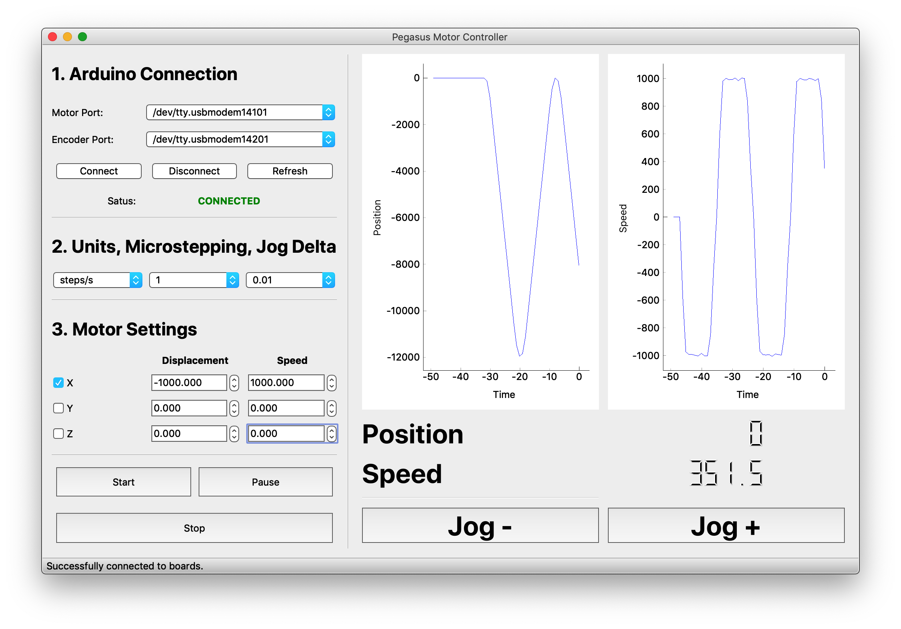

# pegasus: open source stepper motor control

A modular, reliable, and easy-to-use stepper motor controller written in Python and Arduino. Control up to 3 stepper motors simulatenously.
__________________________________


## The tl;dr

The pegasus system allows you to communicate with an Arduino from python to run up to 3 stepper motors, using the Arduino, CNC Motor Shield, and any of the [Pololu Stepper Motor Drivers](https://www.pololu.com/category/120/stepper-motor-drivers). Displacement and speed feedback is reported to the GUI via an additional Arduino and a [rotary encoder](https://www.amazon.com/Signswise-Incremental-Encoder-Dc5-24v-Voltage/dp/B00UTIFCVA/ref=sr_1_3?keywords=rotary+encoder&qid=1572125510&sr=8-3).

## What is included?
* Arduino firmware for use with an Arudino Uno
* A python script to test running a motor
* A GUI to run three motors 
* Serial Communication utilities
* Unit conversion utilities

## What do I need? (Everything is available via Amazon)
* An [Arduino Uno](https://www.amazon.com/Arduino-A000066-ARDUINO-UNO-R3/dp/B008GRTSV6/ref=sr_1_3?keywords=arduino&qid=1570988503&sr=8-3) (or cheap knockoff)
* [Arduino to Computer cable](https://www.amazon.com/AmazonBasics-USB-2-0-Cable-Male/dp/B00NH11KIK/ref=sr_1_3?keywords=arduino+cable&qid=1570989005&sr=8-3)
* [CNC Motor Shield](https://www.amazon.com/HiLetgo®-Engraver-Printer-Expansion-Arduino/dp/B01D2HL9T8/ref=sr_1_5?keywords=cnc+motor+shield&qid=1570988531&sr=8-5) for the Arduino
* Pololu [Stepper Motor Driver](https://www.amazon.com/KINGPRINT-DRV8825-Stepper-Driver-Printer/dp/B075XH1TSJ/ref=sr_1_4?keywords=pololu+stepper+motor+driver&qid=1570988556&sr=8-4)
* [Stepper Motor](https://www.amazon.com/STEPPERONLINE-Stepper-Bipolar-Connector-compatible/dp/B00PNEQKC0/ref=sr_1_4?keywords=stepper+motor&qid=1570988610&sr=8-4)
* [OPTIONAL for use with Rotary Encoder] [Stepper motor w/ dual shaft](https://www.amazon.com/Double-Stepper-Bipolar-4-wires-Pinter/dp/B00W98YK5M/ref=sr_1_11?keywords=stepper+motor+dual+shaft&qid=1572125910&s=industrial&sr=1-11)
* [Power cable](https://www.amazon.com/ALITOVE-Converter-5-5x2-1mm-100V-240V-Security/dp/B078RT3ZPS/ref=sr_1_12?keywords=power+cable+to+terminal&qid=1570988714&sr=8-12)
* [Adapter wire](https://www.amazon.com/43x2pcs-Connectors-Security-Lighting-MILAPEAK/dp/B072BXB2Y8/ref=sr_1_11?keywords=power+cable+to+terminal&qid=1570988714&sr=8-11)
* [Optical encoder](https://www.amazon.com/Signswise-Incremental-Encoder-Dc5-24v-Voltage/dp/B00UTIFCVA/ref=sr_1_3?keywords=rotary+encoder&qid=1572125510&sr=8-3)
*  [Timing belot pulley](https://www.amazon.com/Qunqi-Aluminum-Timing-Pulley-Printer/dp/B01IMR6OR0/ref=sr_1_19?keywords=stepper+motor+timing+belt&qid=1572125697&sr=8-19)
* [Timing belt](https://www.amazon.com/iOrion-Printer-Timing-Closed-Rubber/dp/B07KK86NYX/ref=sr_1_9?keywords=stepper+motor+timing+belt&qid=1572125757&sr=8-9)

## Getting Started
Setup the hardware by following this [instructional video](https://www.youtube.com/watch?v=Xl02fsRCJ7U). connect the arduino to your computer, and connect the CNC shield to a power outlet.

Clone or download this repository:
```
$ git clone https://github.com/sbooeshaghi/pegasus.git
```

Open up the [Arduino IDE](https://www.arduino.cc/en/main/software) and load up `motor_serial_com.ino`. Connect to the Arduino that will control the motor, select the right port, and upload the firmware. Load up `encoder.ino`, connect to the Arduino that will control the encoder, select the right port, and upload the firmware.

Go to the terminal and run the test script
```
$ cd tests
$ chmod +x unit_tests.py
$ ./unit_tests.py
```

The code should do the following:
1. Establish a connection with the Arduino,
2. Send over "setup" commands,
3. Send a Run commend, telling the motor to move,
4. Send a Pause command, 
5. Send a Resume command
6. Send a Stop command.

This is the command structure for sending a command from the Python Script to the Arduino :
```
"<mode,motorID,arg_m1,arg_m2,arg_m3>" # no spaces! the command is a string!
```

The possible commands are:
```
Where mode is one of [RUN, STOP, RESUME, PAUSE, SET_SPEED, SET_ACCEL]
motorID is one of int [000, 100, 010, 001, 110, 101, 011, 111] 
arg_m1 is [any floating number]
arg_m2 is [any floating number]
arg_m3 is [any floating number]
```

## Running the GUI
Go to the terminal and run the GUI 
```
$ cd src/GUI
$ chmod +x pegasus_gui.py
$ ./pegasus_gui.py
```

A GUI will be launched and you can do the following:
1. Make sure both of your Arduinos are plugged in (Motor and Encoder)
2. Select the port they are connected to (if you dont see it, try pressing refresh)
3. Press connect to connect to the Arduinos.
4. Set the units, microstepping, jog delta, and speed.
5. Toggle the box associated with the motor you want to run
6. Press "JOG +" To see the motor move.

## A possible failure of unit tests
Make sure that the port the code connects to is the correct port. Notice in the following example, my computer connected to the wrong port (Bluetooth port). 

 ```
 $ ./unit_tests.py
---------------- Testing Valid Cmd ----------------

[setup] Connecting to port: /dev/tty.Bluetooth-Incoming-Port
Traceback (most recent call last):
  File "./unit_tests.py", line 156, in <module>
    main()
  File "./unit_tests.py", line 141, in main
    test_valid_cmd()
  File "./unit_tests.py", line 42, in test_valid_cmd
    print(listen(s))
  File "pegasus/firmware/serial_comm.py", line 128, in listen
    while  ord(x) != startMarker:
TypeError: ord() expected a character, but string of length 0 found
```

If you get the above error then chances are you either 1. don't have the Arduino connected, 2. tried to run the test code while the Arduino firmware was being uploaded to the arduino or 3. the code selected the wrong port programmatically. Check out the port variable that is assigned to `populate_ports()[-1]` in the python script. This automatically returns the last port in the list of `populate_ports()` ports.

## Not implemented yet:
1. User flow control: it is possible for you to press buttons in the wrong order that will cause things to break
2. Different units: currently only steps/s is supported
3. Microstepping: currently only 1/1 microstepping is supported
4. Additional encoders: currently only one encoder reports back to the GUI

## Acknowledgements
This work would not have been possible without the help of the wonderful [Serial Communications Basics Tutorial](https://forum.arduino.cc/index.php?topic=396450.0) by Robin2 at the [Arduino Forum](https://forum.arduino.cc/index.php) and the really awesome [AccelStepper Library](http://www.airspayce.com/mikem/arduino/AccelStepper/classAccelStepper.html) made by Mike McCauley and the amazing [Encoder Library](https://www.pjrc.com/teensy/td_libs_Encoder.html) made by Paul Stoffregen. Also a big thank you to [Professor Lior Pachter](https://liorpachter.wordpress.com) for supporting my work while doing a PhD in [his lab at Caltech](https://pachterlab.github.io).
